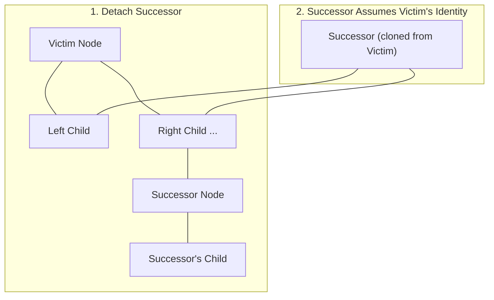

# Intrusive AVL Tree Storage Engine

A production-grade, zero-allocation, intrusive AVL tree implementation built from scratch in C++. This component serves as the core ordering subsystem for the database's Sorted Sets (`ZSET`), enabling guaranteed $O(\log N)$ range-based queries, rank tracking, and lookups.

Unlike textbook data structures, this engine utilizes an **intrusive architecture** and professional low-level system design patterns to optimize cache locality and eliminate dynamic heap allocation overhead.

---

## 🚀 Key Engineering Highlights

### 1. Intrusive Architecture (Zero-Allocation Nodes)
In a standard binary search tree, inserting an element requires dynamically allocating a wrapper node containing the pointers and the payload. This leads to memory fragmentation, high heap overhead, and pointer-chasing during traversals.

This engine embeds the structural tree node (`AVLNode`) directly inside the data payload (`ZNode`):

```cpp
struct ZNode {
    AVLNode tree;    // Structural tree links (parent, left, right, height, cnt)
    HNode hmap;       // Hash table node for O(1) lookup by name
    double score;     // Sorted set score
    size_t len;       // Length of member name
    char name[0];     // Dynamic member name
};
```

To travel from the structural `AVLNode` pointer back to the user payload `ZNode`, the engine uses the `container_of` macro:

```cpp
#define container_of(ptr, type, member) \
    ((type *)((char *)(ptr) - offsetof(type, member)))
```

---

### 2. Branchless Pointer-to-Pointer Rewiring (`from`)
When executing tree rotations or detaching nodes, parent-child links must be updated. Standard implementations use nested `if-else` branches to check whether a node is a left or right child of its parent. 

This engine eliminates these branches by using a **double pointer (`from`)** representing the memory address of the pointer linking to the current sub-root:

```cpp
AVLNode **from = &root;
AVLNode *parent = root->parent;
if (parent) {
    from = parent->left == root ? &parent->left : &parent->right;
}

// Perform rotations ...
*from = new_sub_root; // Directly rewires the parent link without conditional branching!
```

---

### 3. Identity Theft Deletion (`*successor = *node;`)
When deleting a node that has two children, standard trees swap payloads or relocate data records. However, in our Sorted Set implementation, the hash table maintains direct pointers to the `ZNode`'s physical memory address. Moving or swapping payload records would corrupt those hash table references.

Instead, we perform **structural identity theft**:
1. We locate the in-order successor (the leftmost node in the right subtree) and detach it using the single-child deletion helper.
2. We copy the structural properties of the deleted node directly onto the successor: `*successor = *node;`.
3. We update the child pointers of the successor's new children to point back to the successor.
4. The successor cleanly assumes the exact position, heights, and relationships of the deleted node. The physical `ZNode` payload and its memory address remain completely unchanged, preserving hashtable lookup safety.



---

## 🛠️ Deep Dive: Balancing & Rotation Layouts

An AVL tree enforces a balance invariant where the height difference between the left and right subtrees of any node is at most 1 ($\Delta \text{height} \le 1$). Imbalances are resolved using single or double rotations:

### Double Left-Right Rotation (LR Imbalance)
When an inner child causes a zig-zag weight discrepancy, the engine straightens the line before rotating:

```mermaid
graph TD
    subgraph 1. Imbalance (Zig-Zag)
    A((Root)) --> B((Left Child))
    B --> C((Inner Child))
    end

    subgraph 2. rotateLeft(Left Child)
    A2((Root)) --> C2((Inner Child))
    C2 --> B2((Left Child))
    end

    subgraph 3. rotateRight(Root)
    C3((Inner Child)) --> B3((Left Child))
    C3 --> A3((Root))
    end
    
    1. Imbalance (Zig-Zag) --> 2. rotateLeft(Left Child)
    2. rotateLeft(Left Child) --> 3. rotateRight(Root)
```

---

## 💻 API Reference & Specifications

### Struct Definition (`avl.h`)
```cpp
struct AVLNode {
    AVLNode *parent = NULL;
    AVLNode *left = NULL;
    AVLNode *right = NULL;
    uint32_t height = 0; // Absolute height of the subtree
    uint32_t cnt = 0;    // Size of the subtree (used for rank offset lookups)
};
```

### Core Interface

| Function | Complexity | Description |
|---|---|---|
| `void avlInit(AVLNode *node)` | $O(1)$ | Initializes a standalone node. Sets height and cnt to 1. |
| `uint32_t avlHeight(AVLNode *node)` | $O(1)$ | Safely returns node height (0 if null). |
| `uint32_t avlCnt(AVLNode *node)` | $O(1)$ | Safely returns node count (0 if null). |
| `AVLNode *avlFix(AVLNode *node)` | $O(\log N)$ | Re-balances the AVL tree from the mutated node up to the root, executing corrective rotations. Returns the new root. |
| `AVLNode *avlDel(AVLNode *node)` | $O(\log N)$ | Safely detaches a node from the tree and re-balances. Returns the new root. |
| `AVLNode *avl_offset(AVLNode *node, int64_t offset)` | $O(\log N)$ | Shifts relative to `node` by `offset` index positions in sorted order. |
| `int64_t avlRank(AVLNode *node)` | $O(\log N)$ | Computes the 1-based rank (sorted order index) of a node within the tree by climbing to the root. |
