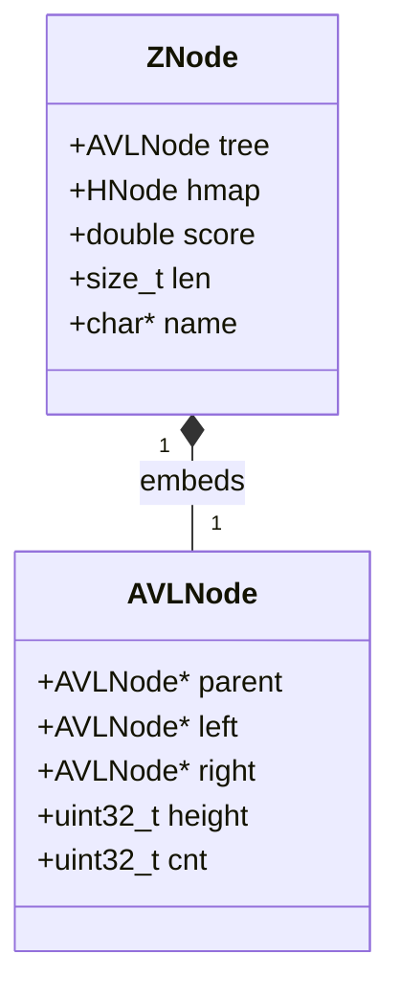
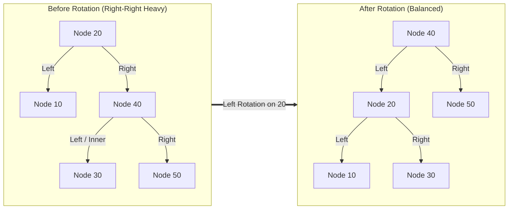
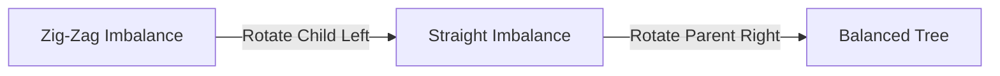

# Intrusive AVL Tree Storage Engine

A zero-allocation, intrusive AVL tree implementation built from scratch in C++. This component serves as the core ordering subsystem for a high-performance in-memory key-value database (similar to Redis's Sorted Sets / `ZSET`), enabling guaranteed $O(\log N)$ range-based queries, rank tracking, and lookups.

Unlike standard generic trees, this library utilizes an **intrusive architecture** to optimize cache locality and eliminate internal heap overhead.

---

## 🚀 Key Engineering Highlights

### 1. Intrusive Architecture (Zero-Allocation Nodes)

In a standard binary tree, the tree object allocates a wrapper node for every value inserted, causing memory fragmentation and cache misses.

This engine uses an **intrusive layout**: the data container itself owns the structural `AVLNode`. The tree handles arrangement entirely by reaching inside your database rows.



To travel from a raw tree node back up to your database fields, we use the macro:

```cpp
#define container_of(ptr, type, member) \
    ((type *)((char *)(ptr) - offsetof(type, member)))
```

### 2. Branchless Pointer-to-Pointer Rewiring (`from`)

When a tree executes a structural rotation, parent-child links must be adjusted. This engine eliminates branch-heavy checks (to determine if a node is its parent's left or right child) by using a dynamic **pointer-to-pointer (`from`)** alias trick inside `avlFix`:

```cpp
AVLNode **from = &root;
AVLNode *parent = root->parent;
if (parent) {
    from = parent->left == root ? &parent->left : &parent->right;
}
*from = new_sub_root; // Updates parent branch directly without conditional forks!
```

### 3. Identity Theft Deletion (`*successor = *node;`)

When deleting a node that possesses two active children, we cannot safely move its database record because other indexing structures (like the hashtable) reference its memory address.

We solve this using **structural identity theft**:
1. We locate the node's sorted successor (minimum node in its right subtree) and detach it cleanly.
2. We copy only the structural tracking fields of the victim straight over the successor using value cloning: `*successor = *node;`.
3. The successor instantly assumes the position, pointers, and height relationships of the deleted node, leaving the user's data record locked safely at its original memory address.

---

## 🛠️ Deep Dive: Balancing & Rotation Layouts

An AVL tree enforces a strict rule: the height difference between the left and right subtrees of any node can never exceed 1.

### Single Left Rotation (RR Imbalance)

Triggered when the right child's right side stretches too deep. The system re-parents the inner subtree and pulls the right child up to restore balance.



### Double Left-Right Rotation (LR Imbalance)

When the imbalance is zig-zag, we first rotate the child to straighten the path, then rotate the parent to balance the tree:



---

## 💻 API Reference

```cpp
struct AVLNode {
    AVLNode *parent = NULL;
    AVLNode *left = NULL;
    AVLNode *right = NULL;
    uint32_t height = 0; // Height of the subtree
    uint32_t cnt = 0;    // Size of the subtree (used for rank queries)
};
```

| Function Signature | Description | Time Complexity |
| :--- | :--- | :--- |
| `inline void avlInit(AVLNode *node)` | Initializes a node to height=1, cnt=1. | $O(1)$ |
| `AVLNode *avlFix(AVLNode *node)` | Re-balances the tree from `node` up to the root. Returns the new root. | $O(\log N)$ |
| `AVLNode *avlDel(AVLNode *node)` | Detaches `node` from the tree and re-balances. Returns the new root. | $O(\log N)$ |
| `AVLNode *avl_offset(AVLNode *node, int64_t offset)` | Jumps relative to `node` by a positive or negative index using subtree count (`cnt`) fields. | $O(\log N)$ |
| `int64_t avlRank(AVLNode *node)` | Returns the 1-based rank (sorted order index) of a node within the tree. | $O(\log N)$ |
