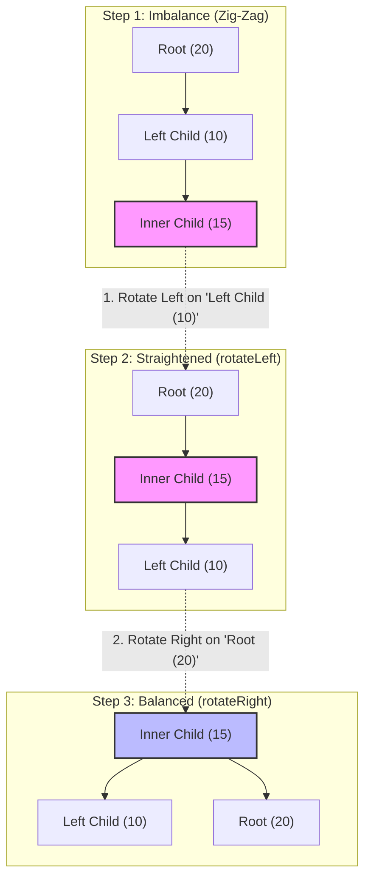

# Intrusive AVL Tree Storage Engine (Beginner Friendly)

Welcome! This document explains the **AVL Tree** component of this database in a way that is easy to understand, even if you are completely new to data structures.

---

## 🧸 1. What is a Balanced AVL Tree? (The Baby Crib Mobile Analogy)

Imagine a **mobile hanging over a baby's crib**. 
* If you hang toys unevenly, the mobile tilts to one side and becomes unbalanced.
* To fix it, you have to shift the strings and re-hang the toys so the mobile stays level.

An **AVL Tree** is exactly like that mobile. It is a tree structure used to store sorted data. When we add or remove items, the tree can become lopsided. An AVL tree automatically "rotates" its nodes to stay balanced. 

### Why is balance important?
If a tree is perfectly balanced, finding any item is incredibly fast. Instead of searching through every single item one-by-one, we can divide our search in half at each step (Binary Search). This takes $O(\log N)$ time. For example, finding a key out of **1,000,000 items** takes at most **20 steps**!

---

## 🔗 2. What does "Intrusive" mean? (The Hooks Analogy)

In standard programming textbooks, a tree is built by creating a bunch of helper "boxes" (node wrappers). Each box holds the data and pointers to other boxes. This creates a lot of memory trash and slows down the CPU.

Our AVL tree is **Intrusive**. Think of it this way:
* **Textbook Tree (Standard)**: You put your grocery items inside cardboard boxes, and then link the boxes together. This wastes cardboard (memory) and time opening boxes.
* **Intrusive Tree (Ours)**: The groceries have **built-in metal hooks**! The items hook onto each other directly. No extra cardboard boxes are created.

### How it looks in C++:
We embed the structural tree hooks (`AVLNode`) directly inside our data item (`ZNode`):

```cpp
struct ZNode {
    AVLNode tree;    // The built-in hooks (parent, left, right pointers)
    HNode hmap;       // Another hook for the Hash Table lookup
    double score;     // The score of the item (e.g., 99.5)
    size_t len;       // Length of the name
    char name[0];     // The name of the item (e.g., "Alice")
};
```

To travel from the structural hooks (`AVLNode*`) back to our data item (`ZNode*`), we use a macro called `container_of` which calculates the memory offset:

```cpp
// Casts the hook pointer back to the full ZNode pointer
ZNode *node = container_of(avl_node_ptr, ZNode, tree);
```

---

## ⚡ 3. Branchless Pointer Rewiring (Direct Hook Control)

When we balance the tree by moving nodes around, we have to update links. Normally, you have to ask a lot of questions:
* *"Am I my parent's left child?"*
* *"Or am I my parent's right child?"*

Asking these questions creates conditional branches (`if/else`) that slow down modern CPUs.

To avoid this, our code uses **double pointers (`from`)** to hold the address of the parent's pointer directly:

```cpp
AVLNode **from = &root;
AVLNode *parent = root->parent;
if (parent) {
    // We grab the exact memory address of the pointer branch pointing to us
    from = parent->left == root ? &parent->left : &parent->right;
}

// Perform rotations...
*from = new_sub_root; // Directly rewires the parent link, no if/else needed!
```

---

## 🎭 4. Identity Theft Deletion (Keeping Memory Safe)

When we delete an item from the sorted tree, we have a problem:
* The database has a Hash Table that points directly to our item's physical home address in memory.
* If we delete a middle node and try to move other nodes to take its place on the heap, those memory addresses change, and the Hash Table pointers will break!

To solve this, we perform **Identity Theft**:
1. We find a node at the bottom of the tree (called the **Successor**) that is safe to remove without breaking children.
2. We detach that successor from the bottom.
3. We copy the structural hooks of the victim node directly onto the successor: `*successor = *node;`.
4. The successor now instantly assumes the exact position, height, parent, and children of the deleted node.
5. The original data record stays at the exact same memory address. The Hash Table is happy, and the tree is correct!

---

## 🔄 5. Visualizing Tree Rotations (Zig-Zag to Straight Line)

When you insert a node and create a zig-zag shape (a "Left-Right" imbalance), the AVL tree does a double rotation to balance itself:
1. **First Rotation**: It rotates the child node to turn the zig-zag shape into a straight line.
2. **Second Rotation**: It rotates the root node to flatten the straight line into a balanced pyramid.

Here is the exact step-by-step flow:



---

## 🛠️ 6. API Reference & Specifications

### Struct Definition (`avl.h`)
```cpp
struct AVLNode {
    AVLNode *parent = NULL; // Pointer to parent node (NULL if root)
    AVLNode *left = NULL;   // Pointer to left child (NULL if none)
    AVLNode *right = NULL;  // Pointer to right child (NULL if none)
    uint32_t height = 0;    // How tall this subtree is
    uint32_t cnt = 0;       // Total number of nodes inside this subtree
};
```

### Core Interface Functions

| Function | Speed (Complexity) | What it does |
|---|---|---|
| `avlInit(node)` | $O(1)$ | Sets up a fresh, standalone node (height=1, count=1). |
| `avlHeight(node)` | $O(1)$ | Safely returns the height of a node (0 if null). |
| `avlCnt(node)` | $O(1)$ | Safely returns the number of nodes in this subtree (0 if null). |
| `avlFix(node)` | $O(\log N)$ | Walks up the tree fixing heights and performing rotations to restore balance. |
| `avlDel(node)` | $O(\log N)$ | Removes a node from the tree and re-balances it. |
| `avl_offset(node, offset)` | $O(\log N)$ | Jumps forward or backward by `offset` positions (e.g., "get the 5th item after this node"). |
| `avlRank(node)` | $O(\log N)$ | Returns the sorted rank index (1-based position) of this node in the tree. |
