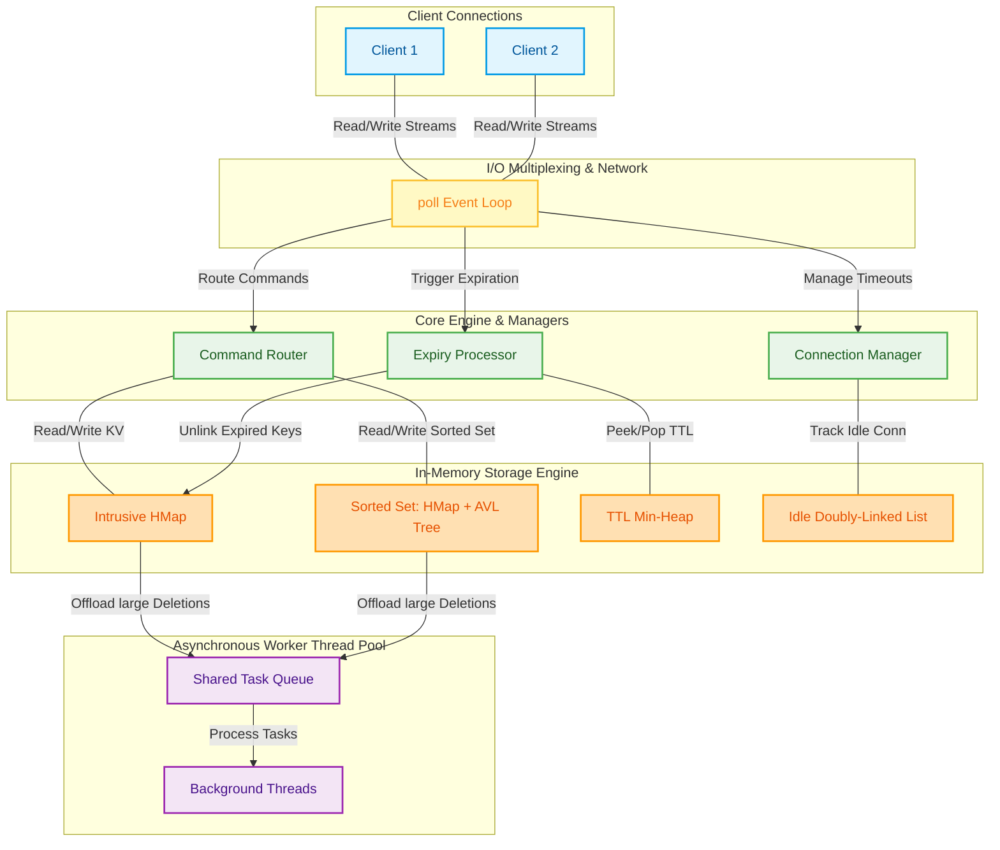

# Custom High-Performance Redis Server in C/C++

A high-performance, single-threaded event-loop based in-memory key-value store built from scratch in C/C++. The project features custom data structures, incremental rehashing, connection timeouts, key expiration (TTLs), and a thread pool to offload heavy deletion operations asynchronously.

---

## 🏗️ System Architecture & Components

The server uses an asynchronous **Event Loop** multiplexed with `poll` to manage thousands of concurrent client connections. 



### Key Engineering Subsystems

1. **[Intrusive hashtable](file:///home/abhisek/Redis-Server/hashtable)**: A resizable hashmap that utilizes **Progressive Rehashing** to copy buckets incrementally during query processing, preventing database freeze.
2. **[Intrusive AVL Tree](file:///home/abhisek/Redis-Server/AVLtrees)**: A zero-allocation height-balanced binary search tree used for sorting keys and scores, supporting rank tracking and range queries in $O(\log N)$.
3. **[Hybrid Sorted Set (ZSet)](file:///home/abhisek/Redis-Server/zset)**: Fuses the AVL Tree and Hashtable into a single co-located memory node (`ZNode`) to support both $O(1)$ lookups and $O(\log N)$ range queries.
4. **[Thread Pool](file:///home/abhisek/Redis-Server/threadPool)**: A Pthread-based thread pool designed for graceful shutdown that offloads large sorted set deallocations asynchronously, mimicking Redis's `UNLINK` command.
5. **TTL Min-Heap**: Dynamically schedules key expiration events, allowing the server to clean up expired keys in $O(1)$ during the event loop idle cycles.
6. **Connection Timeout Lists**: Manages read/write timeouts and idle connections in $O(1)$ using doubly-linked list nodes embedded in the connection state structures.

---

## 📁 Repository Layout

| Directory / File | Description |
| :--- | :--- |
| **`server.cpp`** | The main database server containing the event loop, socket configuration, parser, and command processor. |
| **`client.cpp`** | A simple CLI client tool to communicate with the server over TCP. |
| **`hashtable/`** | The progressive resizable hashmap. |
| **`AVLtrees/`** | The intrusive AVL tree library. |
| **`zset/`** | The hybrid Sorted Set (`ZSET`) combining AVL tree & hashmap. |
| **`threadPool/`** | The task queue and worker threads for asynchronous deletes. |
| **`heap/`** | The binary min-heap implementation used for key TTL scheduling. |
| **`list/`** | Intrusive double-linked list for managing connection timeouts. |

---

## 🚀 Getting Started

### Prerequisites
* A Linux environment or Windows Subsystem for Linux (WSL).
* GCC Compiler (`g++` supporting C++17).
* GNU Make.

### Build instructions
Compile the server and client using the provided Makefile:
```bash
make clean
make
```

### Running the Server
Start the database server (listens on port `1234` by default):
```bash
./server
```

### Running the Client
Open a separate terminal window and interact with the database using the client executable:
```bash
./client
```

You can run commands like:
* `set mykey myval`
* `get mykey`
* `keys`
* `del mykey`
* `zadd myzset 10.5 memberA`
* `zquery myzset 10.0 memberA 0 10`
* `pexpire mykey 10000` (expires in 10 seconds)
* `pttl mykey`
