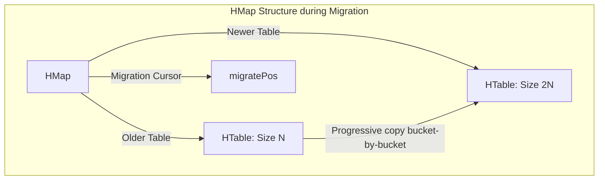

# Intrusive Resizable Hashtable with Progressive Rehashing

This component is a high-performance, intrusive hashmap implementation built in C++. It forms the lookup backbone of our database, providing $O(1)$ average point operations without blockages.

---

## 🚀 Key Engineering Highlights

### 1. Intrusive Hash Nodes

Instead of storing data pointers or values directly inside the hashtable buckets, our database records embed the structural hash node (`HNode`) inside their memory layouts.

```cpp
struct HNode {
    HNode *next = NULL; // Pointer to the next node in the chain
    uint64_t hcode = 0; // Precomputed hash value
};
```

This design avoids separate memory allocations for bucket elements, dramatically improving cache locality. To go from an `HNode` back to your wrapping data structure, the database uses the standard offset calculations via `container_of`:

```cpp
struct Entry {
    HNode node; // Embedded hash node
    std::string key;
    std::string value;
};

// Retrieve Entry pointer from HNode pointer
Entry *ent = container_of(hnode_ptr, Entry, node);
```

---

## 🔄 Progressive Rehashing (Incremental Migration)

In typical hashmaps, when the load factor gets too high, the entire table is resized, and all entries are rehashed into a new table in a single blocking step. In an event-loop database, this creates latency spikes.

Our hashtable uses **Progressive Rehashing**:
1. When the map needs to grow or shrink, we initialize a second, empty table (`newer`) that is twice (or half) the size of the current table (`older`).
2. Instead of moving all elements at once, we move a small batch of entries (e.g., from one bucket slot) from `older` to `newer` during every database lookup, insertion, or deletion.
3. Once all elements have been moved (`migratePos` reaches the end of `older`), we destroy the `older` table and make the `newer` table the active one.

### Dual-Table Setup during Rehashing
During active migration, lookups search both tables to locate a key. Insertions always write to the `newer` table.



---

## 💻 API Reference

```cpp
struct HTable {
    HNode **tab = NULL; // Array of buckets (bucket list chains)
    size_t mask = 0;    // Mask = Table size - 1 (forces size to be a power of 2)
    size_t size = 0;    // Number of elements currently in the table
};

struct HMap {
    HTable newer;
    HTable older;
    size_t migratePos = 0; // Current bucket index undergoing migration
};
```

| Function Signature | Description | Time Complexity |
| :--- | :--- | :--- |
| `HNode *hmLookup(HMap *hmap, HNode *key, bool (*eq)(HNode*, HNode*))` | Looks up a node. Triggers progressive rehashing steps. | $O(1)$ average |
| `void hmInsert(HMap *hmap, HNode *node)` | Inserts a new node. Triggers rehashing checks and steps. | $O(1)$ average |
| `HNode *hmDelete(HMap *hmap, HNode *key, bool (*eq)(HNode*, HNode*))` | Deletes and returns a node from the map. Triggers rehashing steps. | $O(1)$ average |
| `void hmClear(HMap *hmap)` | Deallocates all resources and clears the tables. | $O(N)$ |
| `size_t hmSize(HMap *hmap)` | Returns the total count of active elements in the map. | $O(1)$ |
| `void hmForeach(HMap *hmap, bool (*f)(HNode*, void*), void *arg)` | Traverses all elements and executes callback `f`. | $O(N)$ |
