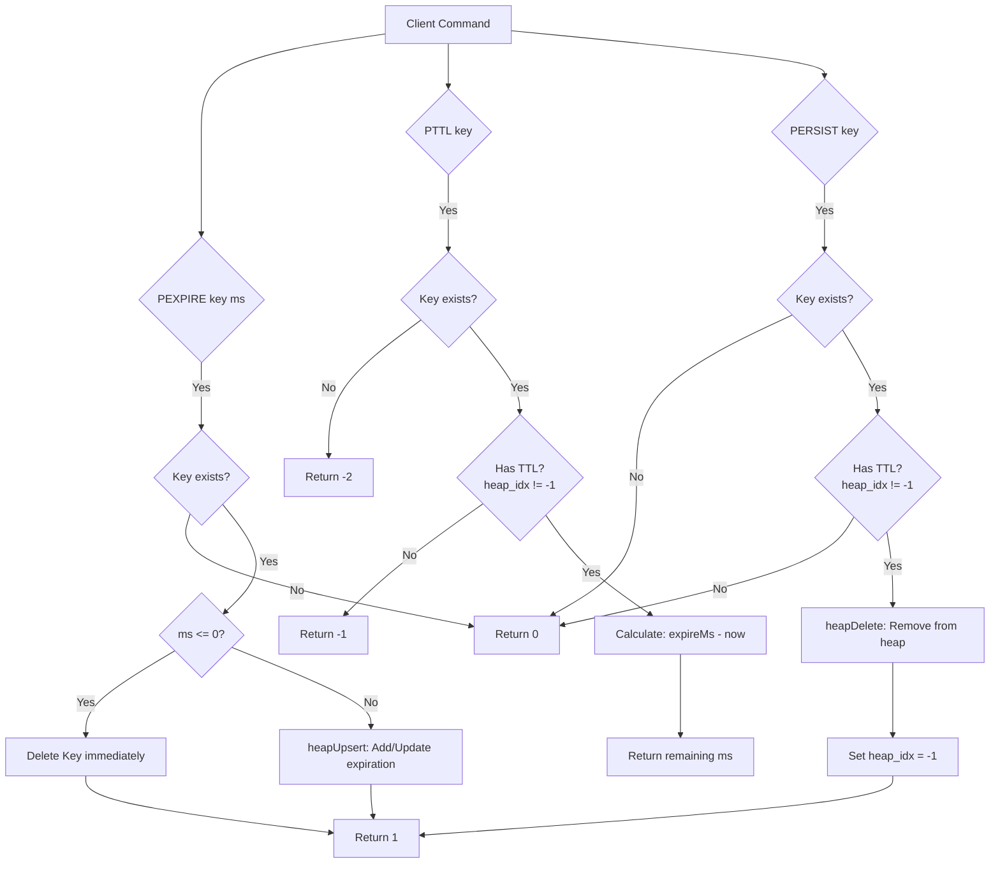

# Intrusive Min-Heap TTL (Time-To-Live) System

This directory implements an **Intrusive Min-Heap** to manage key expirations (TTL) in $O(\log N)$ time for updates/deletions and $O(1)$ time for finding the next expiring key.

---

## 1. Architecture Overview

In a typical heap implementation, elements are stored in a contiguous array, and lookup of a specific element within the heap is an $O(N)$ operation. This makes modifying or deleting a key's TTL slow.

To solve this, our design uses an **intrusive data structure**:
* The database entry (`Entry` in `server.cpp`) stores `heap_idx`, which tracks its index inside the `gData.heap` array.
* The `HeapItem` in the heap stores:
  * `val`: The monotonic expiration time (in milliseconds).
  * `ref`: A pointer back to `Entry::heap_idx`.
* When items are swapped or shifted inside the heap, the heap update functions (`heapUp`, `heapDown`) automatically update the `heap_idx` of the corresponding `Entry` via the `ref` pointer:
  `*heap[pos].ref = pos;`
* This allows **$O(1)$ lookup** of any entry's position in the heap, enabling **$O(\log N)$ updates (`heapUpsert`) and deletions (`heapDelete`)**.

---

## 2. Process Flows

### A. Expiration Cleanup Loop
The server uses a combination of passive and active expiration. In the main event loop, it calculates the time until the next key expires, sleeps for that duration, and cleans up expired keys.

```mermaid
graph TD
    Start([Start Event Loop Iteration]) --> NextTimer[Call nextTimerMs]
    NextTimer --> CheckHeap{Is Heap empty?}
    
    CheckHeap -- No --> MinTimeout[timeout = min(idle_timeout, heap[0].val - now)]
    CheckHeap -- Yes --> IdleTimeout[timeout = idle_timeout]
    
    MinTimeout --> Poll[poll sockets, wait up to timeout]
    IdleTimeout --> Poll
    
    Poll --> HandleIO[Read/Write socket operations]
    HandleIO --> Timers[processTimers]
    
    subgraph Active Expiration
    Timers --> LoopHead{Heap not empty AND<br>heap[0].val < now AND<br>deleted < 2000?}
    LoopHead -- Yes --> Delete[Delete key from hashtable]
    Delete --> Free[entryDel: Free memory & heapDelete]
    Free --> LoopHead
    end
    
    LoopHead -- No --> Start
```

---

### B. Command Routing Flow
Here is how commands like `PEXPIRE`, `PTTL`, and `PERSIST` interact with the heap:



---

## 3. Data Structures & API Reference

### `HeapItem`
```cpp
struct HeapItem {
    uint64_t val;       // Expiration time in monotonic milliseconds
    size_t *ref = NULL; // Pointer to Entry::heap_idx
};
```

### Functions (`heap.h`)

| Function | Complexity | Description |
|---|---|---|
| `heapUpsert(heap, pos, t)` | $O(\log N)$ | Inserts a new expiration or updates an existing expiration. |
| `heapDelete(heap, pos)` | $O(\log N)$ | Removes an expiration entry from the heap and updates positions. |
| `heapUpdate(heap, pos, len)` | $O(\log N)$ | Restores the heap property by sift-up or sift-down operations. |
