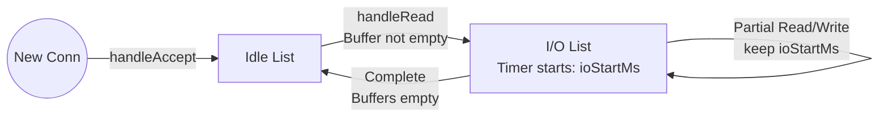

# Dual-List Connection Timer System

This directory contains the doubly linked list implementation  and its application in the Redis server  to implement a robust **Dual-List Connection Timer System**.

## 1. Architectural Motivation

A high-performance network server needs to handle thousands of concurrent connections efficiently. To protect system resources (file descriptors, memory, buffers) from exhaustion, two distinct timeout mechanisms must run side-by-side:

### Idle Timeout ("Between Requests" Clock)
* **Purpose**: Tracks connections that are completely silent (e.g., a client keeps a persistent connection open but isn't currently sending any data).
* **Timeout duration**: Long fuse (e.g., `k_idle_timeout_ms` = 5,000 ms).
* **Benefit**: Allows efficient reuse of open connections without keeping stale or dead ones forever.

### I/O Timeout ("During Transmission" Clock)
* **Purpose**: Tracks active network read/write transactions. When a client starts sending a command, they must finish sending it quickly. Similarly, if the server is writing a reply, the client must consume it promptly.
* **Timeout duration**: Short fuse (e.g., `k_io_timeout_ms` = 3,000 ms).
* **Benefit**: Prevents **Slowloris DoS Attacks** (where an attacker trickles single bytes slowly to keep the socket alive) and reclaims resources from **Half-Open TCP Sockets** (where a client drops connection mid-transmission due to network loss).

---

## 2. Doubly Linked List 

To support $O(1)$ operations for timer updates, insertion, and detachment, we use a circular doubly linked list with a dummy head node.

```cpp
struct DList {
    DList *prev = NULL;
    DList *next = NULL;
};
```

### Core Operations:
* `dlistInit(DList *node)`: Initializes a node to point to itself (circular structure).
* `dlistEmpty(DList *node)`: Checks if a list contains only the dummy node.
* `dlistInsertBefore(DList *target, DList *newNode)`: Inserts a node before the target. Since the list is circular, inserting before the dummy head node effectively inserts the node at the **back** (tail) of the list.
* `dlistDetach(DList *node)`: Detaches a node from its current position by updating the links of its neighbors.

---

## 3. Server Implementation 

In the server, every client connection is represented by the `Conn` struct, which maintains separate timer nodes for idle and active states:

```cpp
struct Conn {
    int fd = -1;
    // Buffers
    Buffer incoming;
    Buffer outgoing;
    
    // Timestamps
    uint64_t lastActiveMs = 0; // Starts from last completed transaction
    uint64_t ioStartMs = 0;     // Starts from the beginning of a read/write operation
    
    // List Nodes
    DList idleNode;
    DList ioNode;
};
```

### The State Machine

A connection transitions dynamically between the `idleList` and the `ioList` depending on whether its buffers are empty or hold active data.




---

## 4. Code Walkthrough of Key Components

### A. Timer State Transitions
The state transitions are handled dynamically by `connUpdateTimer`:

```cpp
static void connUpdateTimer(Conn *conn) {
    bool hasBuffer = (conn->incoming.size() > 0) || (conn->outgoing.size() > 0);
    
    if (hasBuffer) {
        // Detach from idle list as it's active
        dlistDetach(&conn->idleNode);
        dlistInit(&conn->idleNode); 

        // Start active I/O timer if not already running
        if (dlistEmpty(&conn->ioNode)) {
            conn->ioStartMs = getMonotonicMsec();
            dlistInsertBefore(&gData.ioList, &conn->ioNode);
        }
    } else {
        // Transition back to Idle: Detach from I/O list
        dlistDetach(&conn->ioNode);
        dlistInit(&conn->ioNode);

        // Put at the tail of the idle list
        conn->lastActiveMs = getMonotonicMsec();
        dlistDetach(&conn->idleNode);
        dlistInsertBefore(&gData.idleList, &conn->idleNode);
    }
}
```

### B. Polling Timeout Management
To sleep efficiently, the server calculates the minimum time remaining before the earliest connection expires across both lists:

```cpp
static int32_t nextTimerMs() {
    if (dlistEmpty(&gData.idleList) && dlistEmpty(&gData.ioList)) {
        return -1; // Block indefinitely if no timers are active
    }

    uint64_t nowMs = getMonotonicMsec();
    uint64_t maxTimeout = 0;

    // Check earliest idle connection deadline
    if (!dlistEmpty(&gData.idleList)) {
        Conn *connIdle = container_of(gData.idleList.next, Conn, idleNode);
        maxTimeout = connIdle->lastActiveMs + k_idle_timeout_ms;
    }
    
    // Check earliest I/O connection deadline
    if (!dlistEmpty(&gData.ioList)) {
        Conn *connIo = container_of(gData.ioList.next, Conn, ioNode);
        uint64_t nextIo = connIo->ioStartMs + k_io_timeout_ms;

        if (maxTimeout == 0 || nextIo < maxTimeout) {
            maxTimeout = nextIo; // The I/O connection expires sooner
        }
    }

    if (maxTimeout <= nowMs) {
        return 0; // Immediate wake up to reap
    }
    
    return (int32_t)(maxTimeout - nowMs);
}
```

---

## 5. Defense Against Slowloris
Under a Slowloris attack, a client sends the request headers or payload very slowly (e.g., 1 byte every 2.9 seconds). 
In our design:
1. The moment the first byte is read, `incoming` becomes non-empty, triggering a transition to `ioList` and setting `ioStartMs = current_time`.
2. As subsequent bytes trickle in, the connection **remains** in `ioList`. The `ioStartMs` is **not** reset because the buffers are never fully empty.
3. Once 3 seconds (`k_io_timeout_ms`) elapse from `ioStartMs`, `processTimers()` detects that the connection has expired and terminates it, successfully mitigating the attack.
