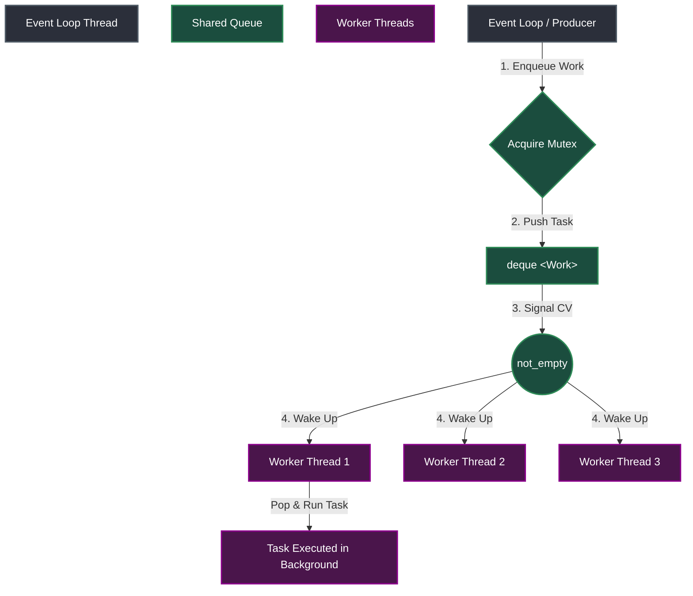
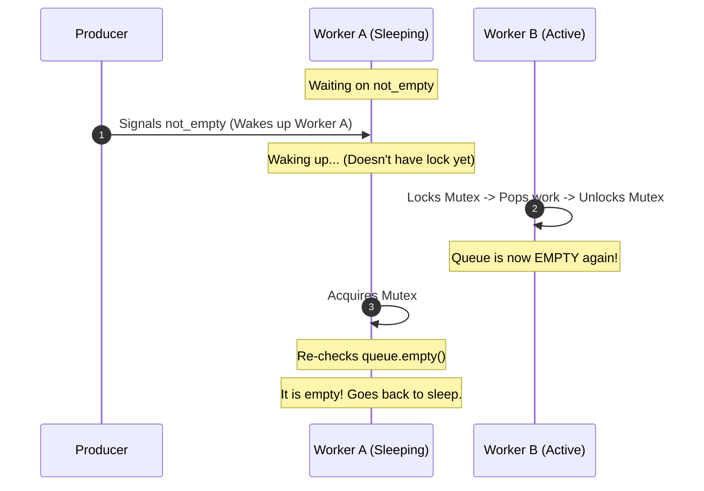
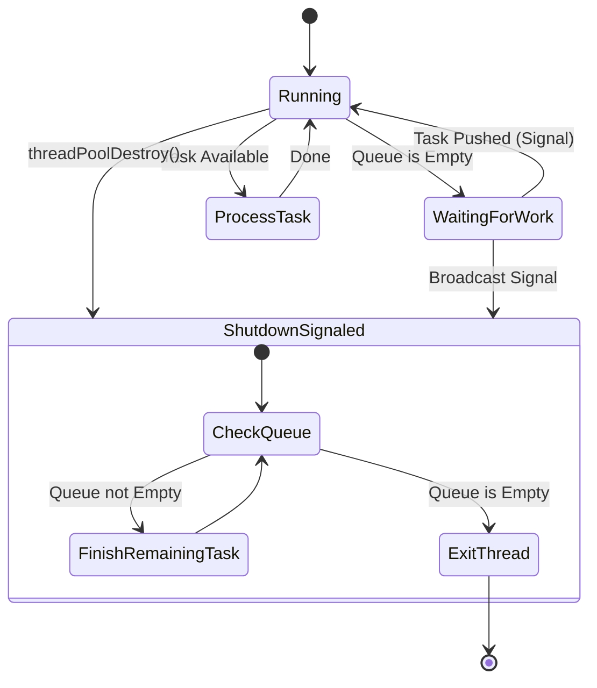

# Thread Pool in Redis Server

This folder contains a lightweight, thread-safe **Pthread-based Thread Pool** implementation. It is designed to handle background task execution (such as asynchronous resource deallocation) without blocking the main event loop.

---

## 1. Why a Thread Pool is Needed

The core of our Redis-like server runs on a single-threaded **event loop** (`poll`-based). 
* **The Rule:** Everything in the event loop must execute quickly. Blocking operations (like blocking I/O or heavy computations) are strictly forbidden because they freeze the entire server for all clients.
* **The Problem:** Deleting large data structures, such as a **Sorted Set (ZSET)** with thousands of elements, is an $O(N)$ operation. Deallocating all these memory nodes synchronously inside the event loop would block the server, causing latency spikes.
* **The Solution:** The server unlinks the key from the database instantly (an $O(1)$ metadata operation) and pushes the heavy memory deallocation task to a background worker thread. This matches the behavior of the Redis `UNLINK` command.

---

## 2. The Producer-Consumer Architecture

The thread pool is built using the classic **Producer-Consumer** concurrency pattern:
* **Producer:** The main event loop (single thread). It pushes tasks (e.g., deleting a ZSET) onto the shared queue.
* **Consumers:** A fixed set of worker threads. They wait for tasks to arrive in the queue, pop them, and execute them.

---

## 3. Synchronization Primitives

To coordinate the producer and consumers safely without race conditions or CPU-wasting "busy-waiting", we use two fundamental synchronization primitives:

### A. Mutex (Mutual Exclusion)
The shared task queue (`std::deque<Work>`) is not thread-safe. If multiple threads access or modify it simultaneously, it causes data corruption. A mutex (`pthread_mutex_t`) acts as a lock, ensuring only one thread can modify the queue at any given time.

### B. Condition Variable
Instead of having worker threads check the queue constantly in a busy loop (which uses 100% CPU), they go to sleep. We use a condition variable (`pthread_cond_t not_empty`) to orchestrate this:
* When the queue is empty, workers release the mutex and sleep on `not_empty`.
* When the producer pushes a task, it signals `not_empty`, waking up one sleeping worker.

---

## 4. Spurious Wakeups & The `while` Loop Guard

In multi-threaded programming, a thread waiting on a condition variable can wake up even if no signal was sent (a **spurious wakeup**). Furthermore, in a multi-consumer setup, another worker might acquire the lock and grab the task before the woken thread gets the chance.

Therefore, we must **always check the condition in a `while` loop**, never an `if` statement:

If we used `if (tp->queue.empty())`, Worker A would proceed to pop from an empty queue, causing a segmentation fault. The `while` loop forces it to recheck and safely go back to sleep.

---

## 5. Graceful Shutdown Flow

To prevent resource leaks and incomplete tasks when shutting down the server, the thread pool supports a **graceful shutdown** sequence:

1. **Signal Shutdown:** `threadPoolDestroy` sets the `shutdown` flag to `true` and broadcasts to all worker threads.
2. **Flush Tasks:** Worker threads process any remaining tasks already in the queue.
3. **Exit:** Once the queue is empty, workers exit their loops cleanly.
4. **Join & Cleanup:** The main thread waits for all workers to exit (`pthread_join`) and destroys the mutex/condition variable.

---

## 6. Code Interface

### Structures
* `Work`: Encapsulates a generic callback function pointer `f` and its arguments pointer `arg`.
* `ThreadPool`: Holds the worker handles, the synchronized queue, mutex, condition variable, and the shutdown flag.

### Functions
* `void threadPoolInit(ThreadPool *tp, size_t num_threads)`: Initializes sync primitives and spawns the workers.
* `void threadPoolQueue(ThreadPool *tp, void (*f)(void *), void *arg)`: Appends a task to the queue and notifies a worker.
* `void threadPoolDestroy(ThreadPool *tp)`: Gracefully terminates all threads and releases all resources.
