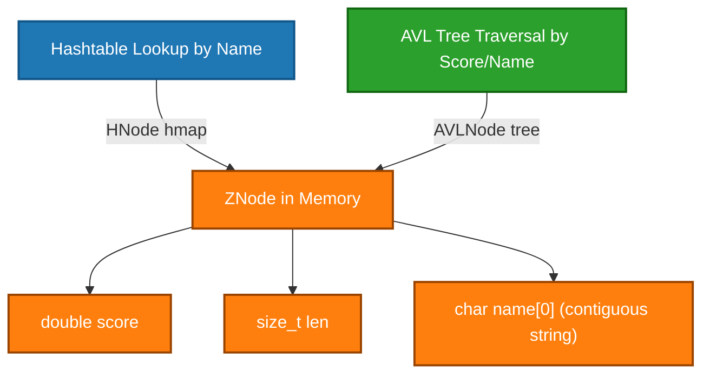
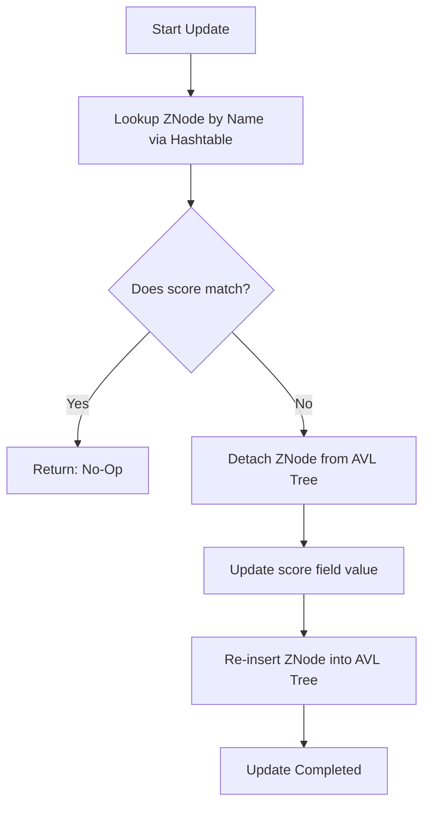

# Hybrid Sorted Set (ZSet) Storage Engine

A production-grade, zero-allocation-overhead **Sorted Set (ZSet)** implementation built from scratch in C++. This component combines an **intrusive AVL tree** and an **intrusive hashtable** to deliver a high-performance ordering and lookup subsystem matching Redis's `ZSET` semantics.

By fusing two distinct indexing paths into a single co-located memory allocation, this engine achieves $O(1)$ point lookups, $O(\log N)$ updates, and $O(\log N)$ rank-based range queries.

---

## 🚀 Key Engineering Highlights

### 1. Dual-Indexed Intrusive Architecture

Unlike standard database engines that store secondary indexes in separate memory structures with independent pointers, this engine co-locates them inside a single `ZNode` allocation. 

A single `ZNode` contains both the AVL tree metadata and the Hashtable node metadata inline:



To move between structural nodes (`tree` or `hmap`) and the wrapping `ZNode` layout, we use standard compiler offsets (`container_of`).

---

### 2. Contiguous Memory Allocation (Zero-Length Array Pattern)

To avoid memory fragmentation and excessive cache misses, the string payload is not stored as an independent heap allocation. Instead, we use a trailing zero-length array (`char name[0]`) to allocate the struct metadata and the variable-length member name in a single contiguous block:

```cpp
struct ZNode {
    AVLNode tree;
    HNode hmap;
    double score = 0;
    size_t len = 0;
    char name[0]; // Struct size is computed as: sizeof(ZNode) + len
};
```

---

### 3. Coordinated Update Operations (Detach-Re-insert)

When updating the score of a member, the element's sorted position in the AVL tree changes, but its entry in the hashtable remains at the same slot.

We coordinate this by unlinking and re-inserting the node **only in the AVL tree**:



This prevents rebuilding the node, leaving the hashtable pointers entirely untouched.

---

## 💻 API Reference

```cpp
struct ZSet {
    AVLNode *root = NULL; // Root pointer of the intrusive AVL tree
    HMap hmap;           // Internal resizable hash map for string lookup
};
```

| Function Signature | Description | Time Complexity |
| :--- | :--- | :--- |
| `bool zsetInsert(ZSet *zset, const char *name, size_t len, double score)` | Inserts a new member or updates the score of an existing one. Returns `true` if inserted, `false` if updated. | $O(\log N)$ |
| `ZNode *zsetLookup(ZSet *zset, const char *name, size_t len)` | Looks up a member ZNode by its string name using the hashtable. | $O(1)$ average |
| `void zsetDelete(ZSet *zset, ZNode *node)` | Removes a member from both the AVL tree and the hashtable, and deallocates it. | $O(\log N)$ |
| `ZNode *zsetSeekge(ZSet *zset, double score, const char *name, size_t len)` | Seeks the first node in the tree whose score/name tuple is $\ge$ the query. | $O(\log N)$ |
| `ZNode *znodeOffset(ZNode *node, int64_t offset)` | Jumps relative to a given node by a positive or negative index offset using subtree sizes. | $O(\log N)$ |
| `int64_t zsetRank(ZSet *zset, const char *name, size_t len)` | Computes the 0-based rank of a member. Returns `-1` if not found. | $O(\log N)$ |
| `void zsetClear(ZSet *zset)` | Fully deallocates all nodes in the sorted set. | $O(N)$ |
